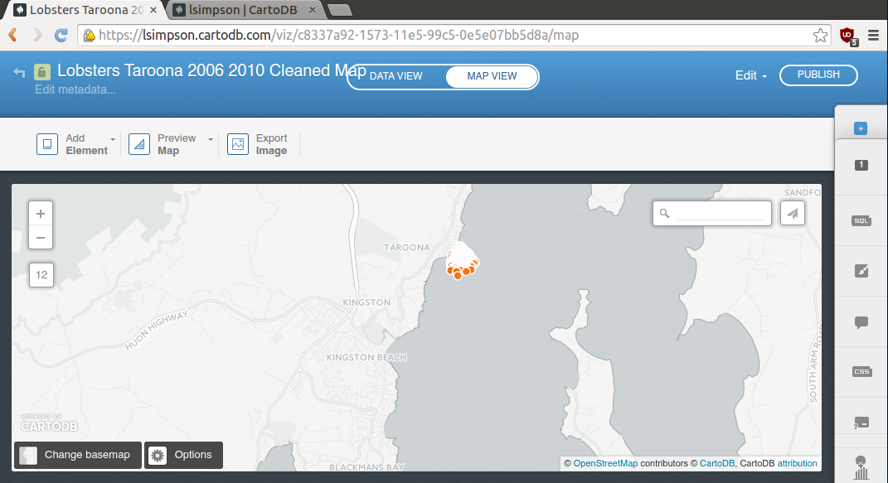
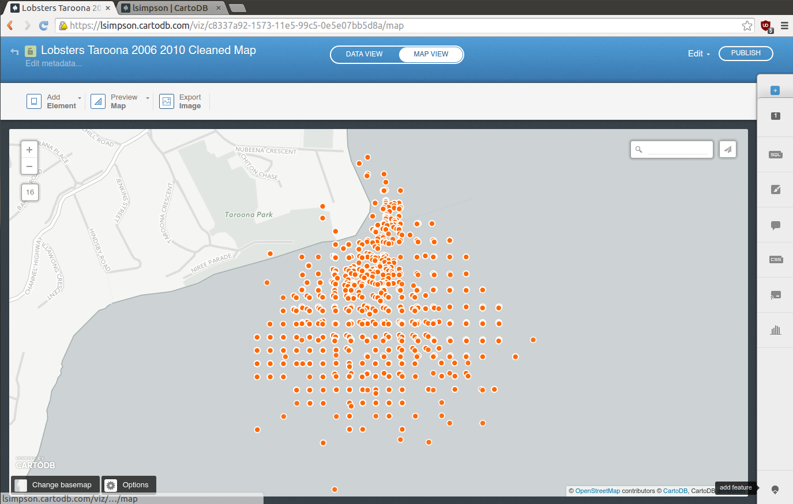
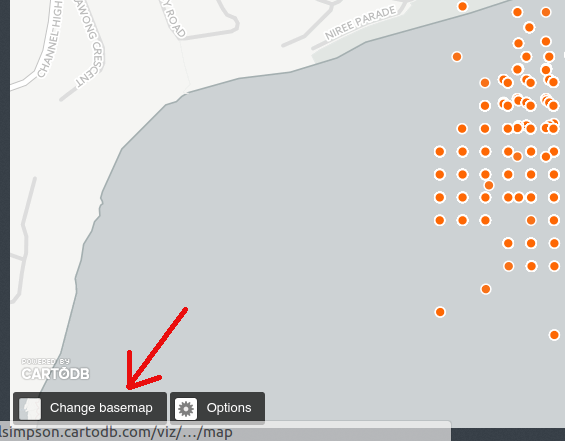
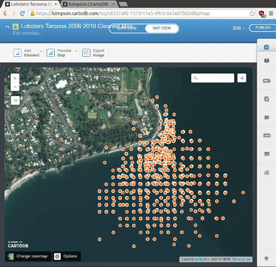
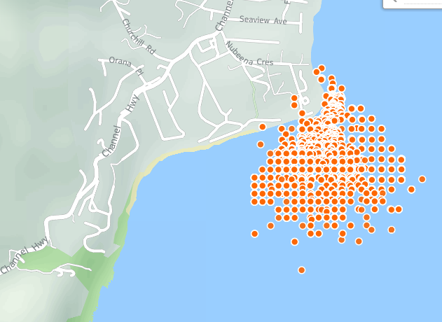
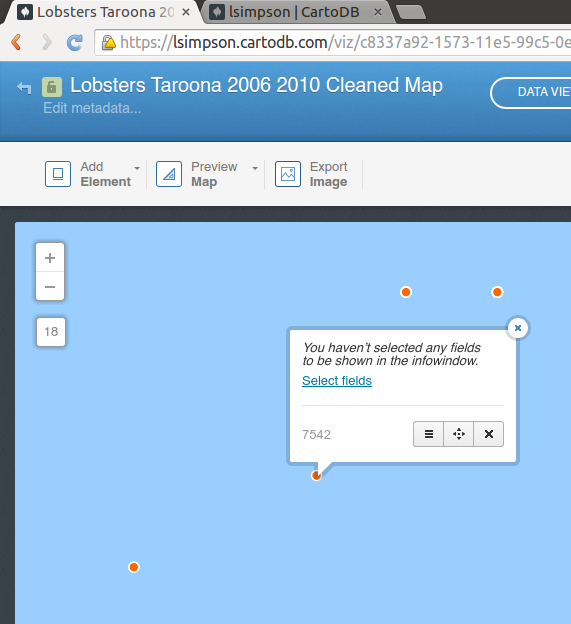
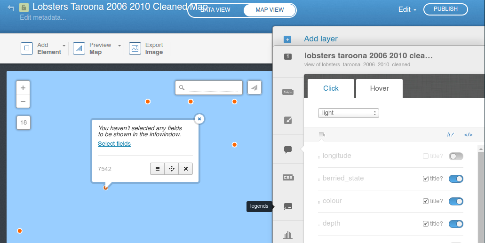
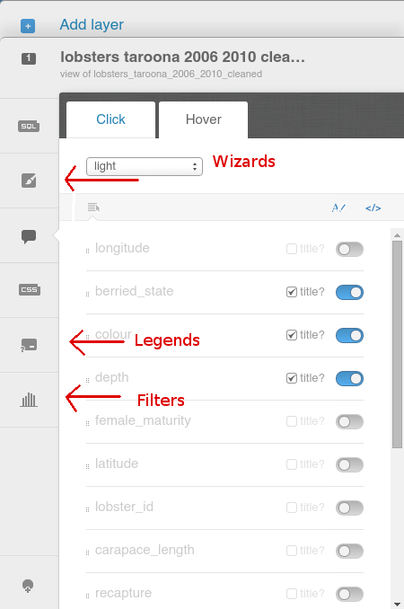

============================
Getting started with CartoDB
============================

Account creation and login
==========================

Go to `CartoDB <http://cartodb.com>`_, create an account, and login.

.. image:: imgs/signup_annotated.png

There is a small wait before you are logged into your Dashboard.

At this point, creating a new map is as easy as dragging and dropping a
suitable file onto the map.

Alternatively, you can use the "New Map" button

.. image:: imgs/dashboard_new_map.png

In the top left we have the simple navigation options - change your view
from maps to datasets, and in the top right we can see our account information
- 50 MB of free data.

.. image:: imgs/dashboard_dropdown.png

.. image:: imgs/dashboard_user.png

A Suitable File
===============

CartoDB is robust - it will accept almost any type of data file that has
geographic data.

The simplest example of this is a comma separated values file, or CSV, which
can be created in Excel from a single page of data.

The only other requirements CartoDB has for data in CSV format are a header
row, and two columns, one latitude, one longitude, each in decimal form.

Let's jump right in. Grab this csv of :download:`Tasmanian lobster observations
<data/lobsters_taroona_2006-2010_cleaned.csv>`.

`Find the Tasmanian lobster observations data here
<https://raw.githubusercontent.com/datakid/cartodb/master/data/lobsters_taroona_2006-2010_cleaned.csv>`_
(right or command click, save as...)

Once it's saved, open the folder you downloaded it to, and drag the file onto
CartoDB

.. image:: imgs/drag_and_drop_data.png

And with that, you have your first map. Ridiculously simple.

(some people may need to scroll to the east a little to see the main lobster
data - they should be right off the coast near Taroona. There is a small
data set just to the west, which is why neither is on screen - you have
been centred.)

Let's Make Pretty
=================

---------
Base Maps
---------

The map isn't much good looking like this - zoom in to get a better feel
for the data set.

To change the underlying map, click the button in the lower right hand corner
that says "Change basemap":

There are a number of maps to choose from, and you can add your own if you
would rather. There's the satellite view:

and the street map view:

------------
Info Windows
------------

At the moment, the data is just dots on a page. That's pretty impressive
for the amount of work we have done, but we *know* there is more than just
location data, and it's all right there. How can we bring it out?

You can pick any data point (in our case, we need to zoom in to get a
particular lobster data point), and click on it.

Click on select fields and the slider will appear on the right hand side with
all the data fields listed.

I have decided to use the hover effect rather than the click effect, so
I choose the hover tab. I then select the data I want to display for each
point on the map.

.. image:: imgs/info_windows_hover.png

----------
The Slider
----------

The slider is the main way to interact with your data and map through the web.
The purpose of many tabs in the right hand column are self evident - SQL gives 
you the opportunity to write your own queries, CSS gives you the chance to 
modify the design.

