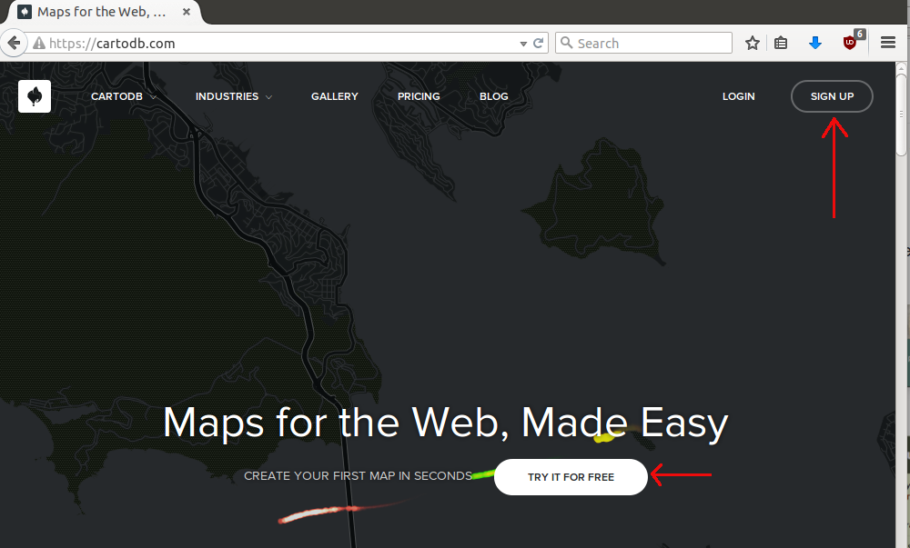
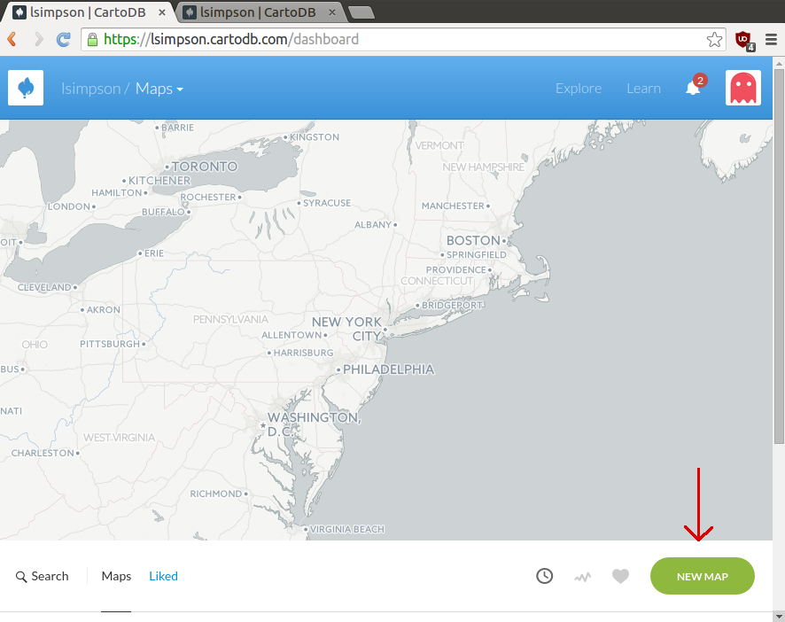
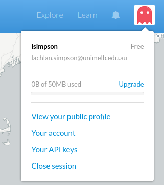
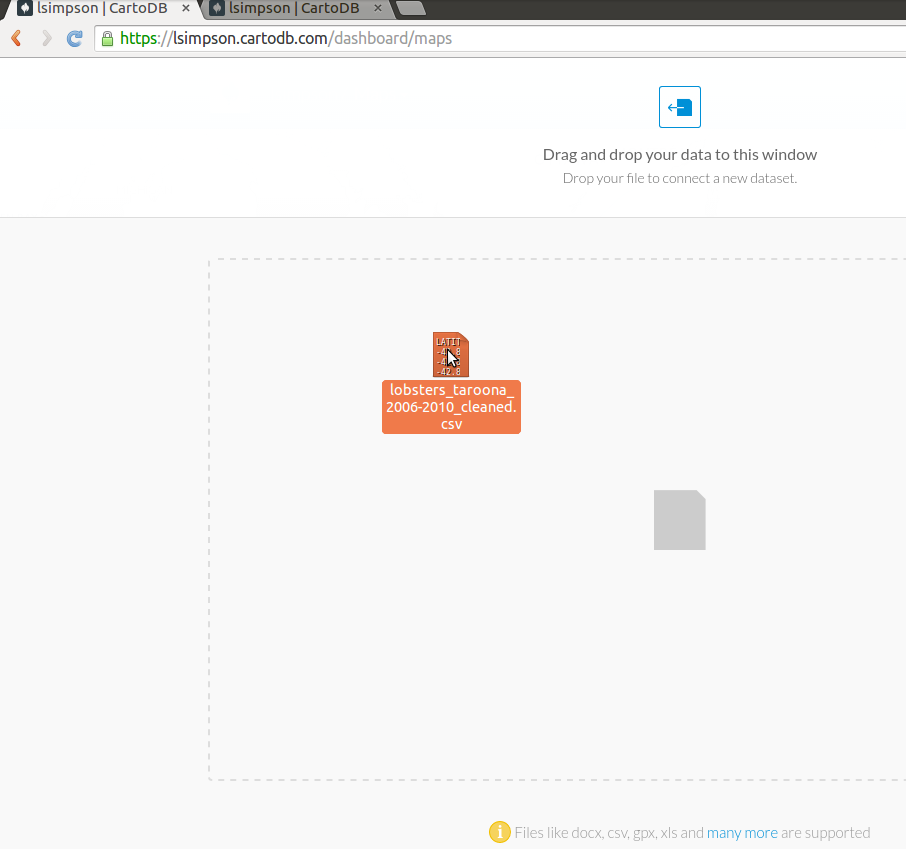

============================
Getting started with CartoDB
============================

Account creation and login
==========================

Go to `CartoDB <http://cartodb.com>`_, create an account, and login.

There is a small wait before you are logged into your Dashboard.

At this point, creating a new map is as easy as dragging and dropping a
suitable file onto the map.

Alternatively, you can use the "New Map" button

In the top left we have the simple navigation options - change your view
from maps to datasets, and in the top right we can see our account information
- 50 MB of free data.

.. image:: imgs/dashboard_dropdown.png

A Suitable File
===============

CartoDB is robust - it will accept almost any type of data file that has
geographic data.

The simplest example of this is a comma separated values file, or CSV, which
can be created in Excel from a single page of data.

The only other requirements CartoDB has for data in CSV format are a header
row, and two columns, one latitude, one longitude, each in decimal form.

Let's jump right in. Grab this csv of :download:`Tasmanian lobster observations
<data/lobsters_taroona_2006-2010_cleaned.csv>`.

`Find the Tasmanian lobster observations data here
<https://raw.githubusercontent.com/datakid/cartodb/master/data/lobsters_taroona_2006-2010_cleaned.csv>`_
(right or command click, save as...)

Once it's saved, open the folder you downloaded it to, and drag the file onto 
CartoDB

