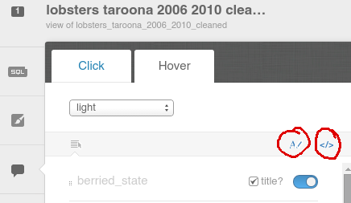
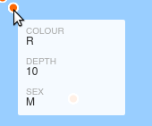
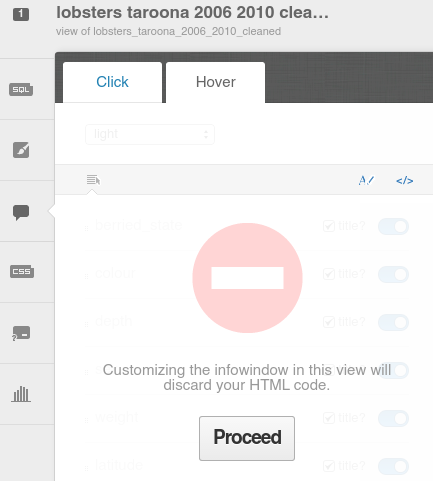
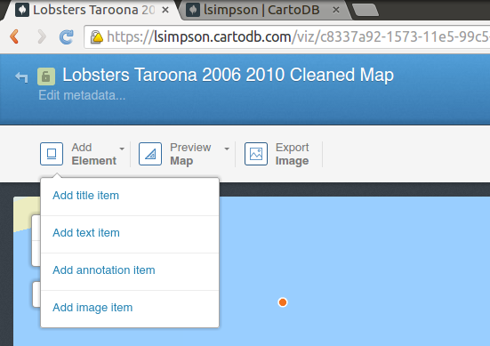
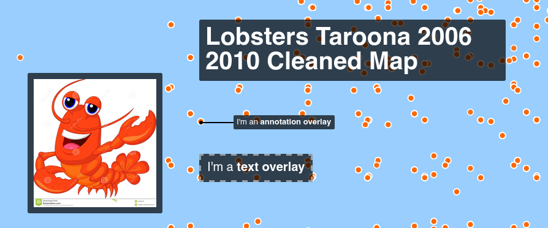
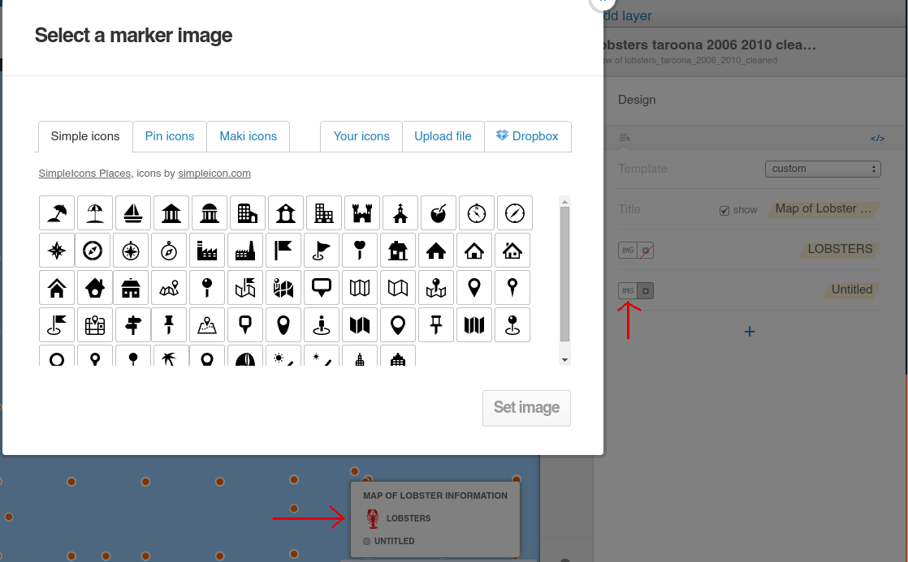
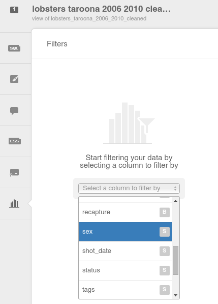
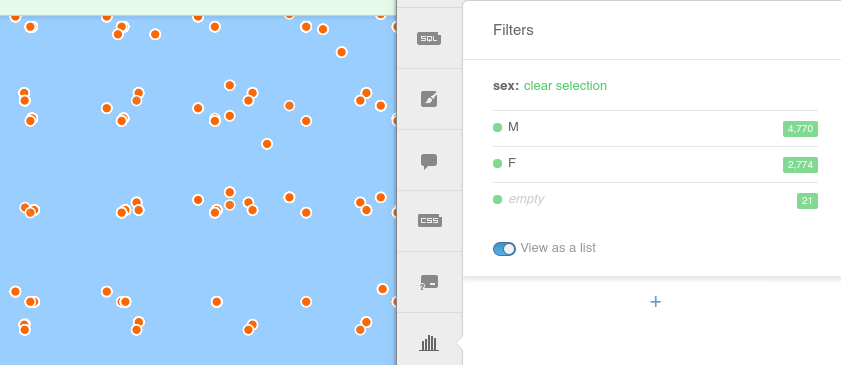
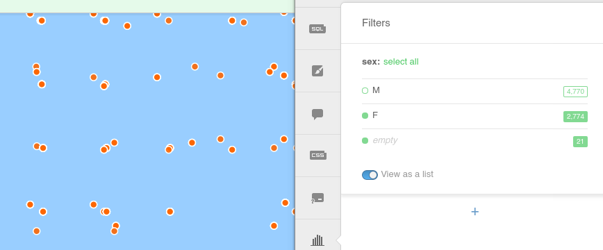

============================
Getting started with CartoDB
============================

Account creation and login
==========================

Go to `CartoDB <http://cartodb.com>`_, create an account, and login.

.. image:: imgs/signup_annotated.png

There is a small wait before you are logged into your Dashboard.

At this point, creating a new map is as easy as dragging and dropping a
suitable file onto the map.

Alternatively, you can use the "New Map" button

.. image:: imgs/dashboard_new_map.png

In the top left we have the simple navigation options - change your view
from maps to datasets, and in the top right we can see our account information
- 50 MB of free data.

.. image:: imgs/dashboard_dropdown.png

.. image:: imgs/dashboard_user.png

A Suitable File
===============

CartoDB is robust - it will accept almost any type of data file that has
geographic data.

The simplest example of this is a comma separated values file, or CSV, which
can be created in Excel from a single page of data.

The only other requirements CartoDB has for data in CSV format are a header
row, and two columns, one latitude, one longitude, each in decimal form.

Let's jump right in. Grab this csv of :download:`Tasmanian lobster observations
<data/lobsters_taroona_2006-2010_cleaned.csv>`.

`Find the Tasmanian lobster observations data here
<https://raw.githubusercontent.com/datakid/cartodb/master/data/lobsters_taroona_2006-2010_cleaned.csv>`_
(right or command click, save as...)

Once it's saved, open the folder you downloaded it to, and drag the file onto
CartoDB

.. image:: imgs/drag_and_drop_data.png

And with that, you have your first map. Ridiculously simple.

.. image:: imgs/first_map.png

(some people may need to scroll to the east a little to see the main lobster
data - they should be right off the coast near Taroona. There is a small
data set just to the west, which is why neither is on screen - you have
been centred.)

Let's Make Pretty
=================

---------
Base Maps
---------

The map isn't much good looking like this - zoom in to get a better feel
for the data set.

.. image:: imgs/zoomed_map.png

To change the underlying map, click the button in the lower right hand corner
that says "Change basemap":

.. image:: imgs/change_basemap.png

There are a number of maps to choose from, and you can add your own if you
would rather. There's the satellite view:

.. image:: imgs/new_basemap.png

and the street map view:

.. image:: imgs/street_map_basemap.png

------------
Info Windows
------------

At the moment, the data is just dots on a page. That's pretty impressive
for the amount of work we have done, but we *know* there is more than just
location data, and it's all right there. How can we bring it out?

You can pick any data point (in our case, we need to zoom in to get a
particular lobster data point), and click on it.

.. image:: imgs/info_windows_start.png

Click on select fields and the slider will appear on the right hand side with
all the data fields listed.

.. image:: imgs/info_windows_choose_data.png

I have decided to use the hover effect rather than the click effect, so
I choose the hover tab. I then select the data I want to display for each
point on the map.

.. image:: imgs/info_windows_hover.png

As you hover over the data points you will see that some of them don't have
complete data - some are missing Berried State (which, for lobster researchers
indicates status of reproductive eggs within the lobster), and others are 
missing Weight. You will also note that the field berried_state is rendered
BERRIED_STATE . Let's fix both of these.

In this image you can see the two links that will take you to the editing page
for each of these. 

Go to the edit page for titles and change berried_state to berried state.

And now let's fix our hover effect so that it doesn't display titles for data 
that doesn't exist. In this case, we will need to write some code. Don't worry 
- at the end of this short exercise you will be able to call yourself a coder
when talking to over inquisitive nerdphews at Christmas. 

Hit the "change HTML" button, and the display will change to look like this:

.. code:: HTML

    

      

        <h4>Berried State</h4>
        
{{berried_state}}

        <h4>colour</h4>
        
{{colour}}

        <h4>depth</h4>
        
{{depth}}

        <h4>sex</h4>
        
{{sex}}

        <h4>weight</h4>
        
{{weight}}

      

    

This is the general guide to use - note that I have added unnecessary 
indenting to make the code easier to read:

.. code:: HTML

    {{#col_name}}
        
{{col_name}}

    {{/col_name}}

    {{^col_name}}
        
No information

    {{/col_name}}

Here you can see that we are using the tags # and ^. The # tells the map 
"ignore if this value doesn't exist/is empty/false". The ^ tells the map "do 
the opposite of the previous selection". 

So, if we change the weight field like such, we will get no titles on empty 
weight values. 

.. code:: HTML

    {{#weight}}  
        <h4>weight</h4>
        
{{weight}}

    {{/weight}}

And if we change the weight field like this, we will get no titles on empty 
weight values, but we will get a heading that says "Weight" and a value that 
says "Not recorded".

.. code:: HTML

    {{#weight}}  
        <h4>weight</h4>
        
{{weight}}

    {{/weight}}
    {{^weight}}
        <h4>weight</h4>
        
Not recorded

    {{/weight}}

We want to remove the tags completely if they are empty, so we make them look
like this:

.. code:: HTML

    

      

        {{#berried_state}}
            <h4>Berried State</h4>
            
{{berried_state}}

        {{/berried_state}}
        {{#colour}}
            <h4>colour</h4>
            
{{colour}}

        {{/colour}}
        {{#depth}}
            <h4>depth</h4>
            
{{depth}}

        {{/depth}}
        {{#sex}}
            <h4>sex</h4>
            
{{sex}}

  	    {{/sex}}
  	    {{#weight}}  
            <h4>weight</h4>
            
{{weight}}

 	    {{/weight}}
      

    

And lo, after we click "Apply", it has worked as we wished:

Note that if we go back to the visual (non code) editing screen, we are 
presented with a warning that we will loose our HTML changes if we click 
"Proceed". This is not a lie - if you want to save your changes, you will need 
to copy the HTML to a text file or something. Otherwise, YOU WILL LOSE YOUR 
CHANGES PERMANENTLY.

--------
Elements
--------

Of course, from the map page we can add titles, annotations, text over lays and
images:

These are all quite garish, but are merely examples of what can be done on this
simplest of maps.

----------
The Slider
----------

The slider is the main way to interact with your data and map through the web.
The purpose of many tabs in the right hand column are self evident - SQL gives 
you the opportunity to write your own queries, CSS gives you the chance to 
modify the design.

.. image:: imgs/the_slider.png

Legends
-------
 
If we choose the Legends tab, we can start adding more design aware features to
the map, like a traditional map legend:

Note that the Legend will *always* be in the lower right hand corner of any 
CartoDB map by default. 

Filters
-------

Reduce your data set by value - eg, remove all the data points 
with "sex = M".

When you select the filters tab you immediately see the option to filter by a 
column in your data. Let's choose sex, because we know it has few potential 
values and will easily illustrate what we want.

After we choose the column we want, the data is interrogated and our available 
choices are displayed

Each of those values is able to be excluded from the data set by clicking on 
it. As you can see here - excluding the male lobsters reduces the number of 
dots on the map - exactly what we would expect.

It's worth noting that here we can see the SQL tab in action - if you know SQL
or are interested in how it might work within CartoDB - click on the SQL tab
with some data excluded.

Without the excluded data, you would see this SQL command:

.. code:: sql

    SELECT * FROM lobsters_taroona_2006_2010_cleaned

When the data is excluded, you will see an SQL statement like this:

.. code:: sql

    SELECT * FROM lobsters_taroona_2006_2010_cleaned WHERE sex IN ('F','') OR sex IS NULL

==============
END tutorial 1
==============

In `Tutorial 2 <cartodb-wizards.rst>`_ we will be looking at the different 
wizards that are available, what each does or how it can be used, and how we 
can share our resulting maps.

