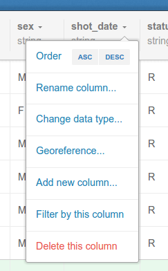
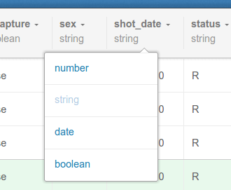
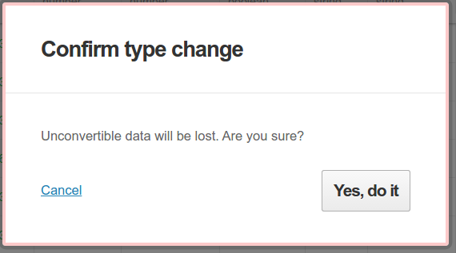
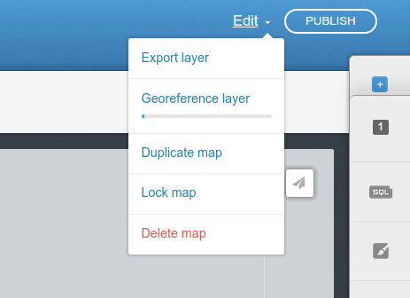
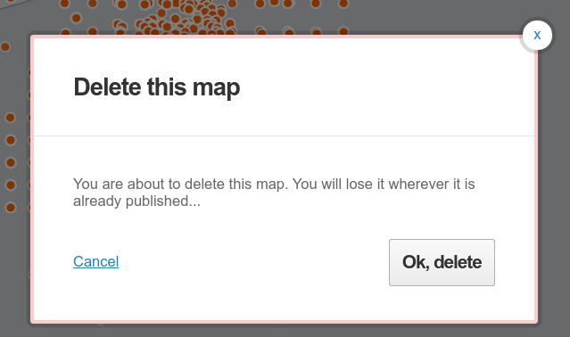
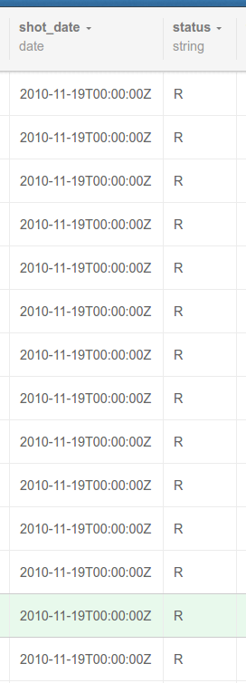
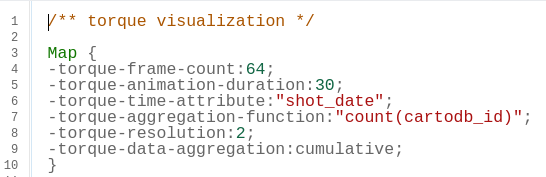

==============================
CartoDB: Exploring the Wizards
==============================

In the `first tutorial <cartodb-first_steps.rst>`_ we quickly got up to the 
point where we could make a workable map with a few easy options and a data 
set. 

There are a number of popular ways to display data effectively on maps, and 
CartoDB comes with a handful out of the box. We will now explore some of the 
these wizards. 

Given the number of options available in some of these wizards, a *lot* of time
can be disappeared just playing around, testing. For this reason we recommend 
you spend time playing around outside of this class, in order to get the best 
result for your data. 

If you click on the Wizard's tab, you will see that in tutorial one we were 
working with the "simple" wizard.

Cluster Maps
============

Cluster maps are really good for showing data at various zoom levels. By 
clustering points that are in a similar vicinity and showing the total, it can
be easier to see where all the action is. 

As you zoom in and out, you will see the numbers increase as points move into
and out of the vicinity of each other.

.. image:: imgs/lobsters_as_clustermap.png

Choropleth Maps
===============

The Choropleth map allows for a second variable to be distinguished in the data - 
as you can see here the carapace length has been divided into five "buckets"
and each bucket given a colour. Now we can see a visualistation of the carapace
length on the map.

.. image:: imgs/choropleth_config.png

.. image:: imgs/lobsters_choroplethmap.png

If none of your variables can be divided into groups, this map is meaningless.  

Category Maps
=============

The category map is similar to the choropleth map but works better on distinct
data rather than continuous data.

In this instance, I've made a category map from the lobster's berried state - 
which is scientifical parlance for "with or without eggs". As the researcher 
Caleb Gardner from the University of Tasmania explains

    n=not berried (not carrying eggs beneath their tails).  y = berried.  All the other variants of berried state = y relate to the state of the eggs.  For example ye = berried eyed = the eyes of the larvae are visible as black dots inside the eggs.  These aren't recorded well so I'd reduce them all down to either y or n.

.. image:: imgs/lobster_categorymap.png

Bubble Maps
===========

Bubble maps are useful for visualising size differences of a numerical value 
column in your data. In the lobster's case, we can again see the carapace
length used, and the different sized bubbles as a result. Note also how it 
stacks neatly the lobsters of different length that are found in the same 
spot.

.. image:: imgs/lobster_bubblemap.png

It's not a perfect data set to show this information - a common usage is as a
population bubble for towns on a map, or as in this case, medal tally in the 
Olympics

.. image:: https://visualign.files.wordpress.com/2012/08/2012londonresults.png

Torque Maps
===========

Torque maps change on a variable that shows either regular growth or a date 
format. For example, if you have a date value that changes per tuple (eg: year 
in which a national constitution is written), your map can automatically show
this in motion. 

Below we see the that the lobster data automatically picks up the tuple id as a
variable to torque, so you see each dot appearing in order. This isn't really 
very usful in this case but shows how the Torque map works.

.. image:: imgs/recorded.gif

The Torque map has some interesting properties, so let's spend some time 
playing.

First, as noted above, the id number is a valid torque, but somewhat useless. 
Let's take a look at the underlying data and see if there is a better field to 
use.

At the top of the screen, you will see the view button, select "Data View" and
we will see the underlying data.

.. image:: imgs/cartodb_view.png

If we scroll across to the shot_date field, we see that the dates are there, 
but unrecognised - they are listed as "string".

.. image:: imgs/cartodb_data_types.png

Drop down the arrow and choose "Change data type..."

You will then be shown the types of data that are available. Choose date.

And then you get a warning. Ergh. Unconvertible data will be lost? What does 
that mean - is it just a warning or is it specifically a warning based on *our*
data? Ergh. Coders need to spend more time with users. Let's click Yes and see
what happens.

And now we see that large parts of the column are null. Bugger. American date
fascists.

.. image:: imgs/cartodb_data_destroyed.png

**Bugger**.

Right. Since we are footloose and fancyfree, let's just fix the data and load 
it again. Depending on your tool (Excel, LibreOffice Calc, etc) there are a 
number of ways to do this which will be left as an exercise for the reader.

In the meantime, `here is one I prepared earlier <https://raw.githubusercontent.com/datakid/cartodb/master/data/lobsters_taroona_2006-2010_cleaned_dates.csv>`_. 
For the record, the difference between the files is one had dates DD-MM-YYYY, 
but CartoDB wants either: MM-DD-YYYY, YYYY-MM-DD or a special back end format
for PostgreSQL that I won't bother explaining. 

Right click that and save as. 

Then, in your map, go to the top roght corner, drop the Edit menu down and 
choose "Delete Map". Yep, let's just nuke it - we haven't really made any big
changes yet, so nuke and rebuild is the easiest route.

You will be asked to confirm...

Now, let's drag the new csv we downloaded on to our empty account page, and see
how it's worked. Great - looks excellent. And we can see that CartoDB has done 
some work in the background to change the date into the back end PostgreSQL 
format I alluded to earlier. 

Where were we? Oh, Torque maps. Right. So let's do that again, with the 
shot_date field instead of the ID field.

It actually looks pretty good. It's worth checking out the config drawer for 
this map - here we can see some interesting effects with a few small changes.

Change the following and see how it affects the map:

* Cumulative
* Marker type
* Duration
* Steps
* Trails (try with cumulative on and off to see the difference; reduce to 0 as 
well)

I think the most interesting is Steps - especially because the list is set to 
certain numbers. Steps indicates what number to divide the total distance by
to get discrete units.

In our case, we have two dates - the earliest is 2006-01-16 and the latest is
2011-10-19. Since the date on each tuple represents a single day, we want days.
So, `using the internet <http://www.timeanddate.com/date/durationresult.html?d1=16&m1=01&y1=2006&d2=19&m2=10&y2=2011&ti=on>`_, 
we find that this is 2103 days.

Again, it's not massively important in this case, but in some cases (where the
granularity is a year for instance, instead of a day), it can change how the
map looks.

To change the steps to what we want is easy - click on the CSS tab, and change
the value of "-torque-frame-count:64" to "-torque-frame-count:2103" and press 
"Apply style".

The reason we are showing you this is because...you will see how easy it is to 
destroy work if you are not careful - if you now click back on the "Wizard" tab
you will see that the value for Steps has returned to 64. If you make *any* 
further changes, steps will revert to 64, you can confirm this by returning to 
the CSS tab.

An annoying gotcha to watch out for.

==============
END tutorial 2 
==============

