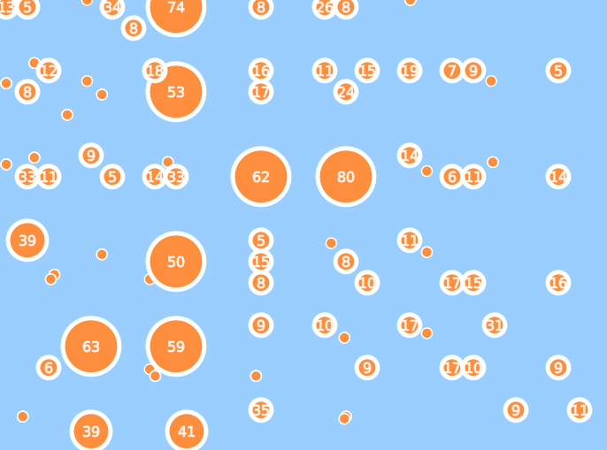
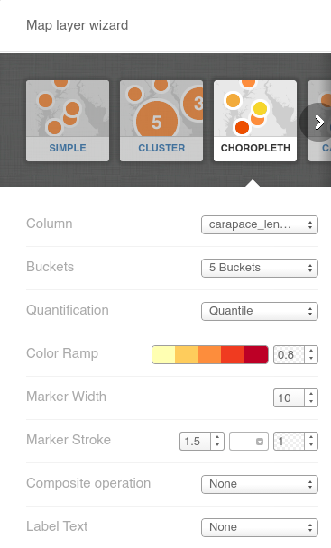

==============================
CartoDB: Exploring the Wizards
==============================

In the `first tutorial <cartodb-first_steps.rst>`_ we quickly got up to the 
point where we could make a workable map with a few easy options and a data 
set. 

There are a number of popular ways to display data effectively on maps, and 
CartoDB comes with a handful out of the box. We will now explore some of the 
these wizards. 

Given the number of options available in some of these wizards, a *lot* of time
can be disappeared just playing around, testing. For this reason we recommend 
you spend time playing around outside of this class, in order to get the best 
result for your data. 

If you click on the Wizard's tab, you will see that in tutorial one we were 
working with the "simple" wizard.

Cluster Maps
============

Cluster maps are really good for showing data at various zoom levels. By 
clustering points that are in a similar vicinity and showing the total, it can
be easier to see where all the action is. 

As you zoom in and out, you will see the numbers increase as points move into
and out of the vicinity of each other.

Choropleth Maps
===============

The Choropleth map allows for a second variable to be distinguished in the data
 - as you can see here the carapace length has been divided into five "buckets"
and each bucket given a colour. Now we can see a visualistation of the carapace
length on the map.

.. image:: imgs/lobsters_choropleth.png

If none of your variables can be divided into groups, this map is meaningless.

==============
END tutorial 2 
==============

